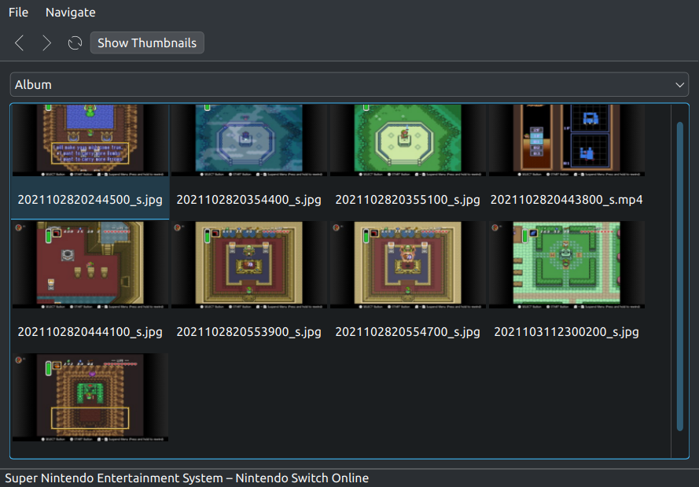

# Android File Transfer For Linux (FreeBSD and macOS, too!)

[](https://github.com/whoozle/android-file-transfer-linux/blob/master/LICENSE)
[](https://github.com/whoozle/android-file-transfer-linux)
[](https://github.com/whoozle/android-file-transfer-linux/actions/workflows/actions.yml)

Android File Transfer for Linux — a reliable [MTP](https://en.wikipedia.org/wiki/Media_Transfer_Protocol) client with minimalistic UI similar to [Android File Transfer](https://www.android.com/intl/en_us/filetransfer/).



It just works™.

## Do I need it?

If you're happy with `gmtp`/`gvfs`/`mtpfs` or any other MTP software, you might not need this software (but give it a try!).

If you're suffering from crashes, missing tags, album covers, USB freezes, and corrupted files however, this software is right for you.

## Pre-built Packages

If your distribution does not provide an `android-file-transfer-linux` package, you can still install it on your system.

There's quite a few packages available:
- AppImage: https://github.com/whoozle/android-file-transfer-linux/releases
- macOS DMG image: https://github.com/whoozle/android-file-transfer-linux/releases
- macOS Homebrew: `brew install --cask whoozle-android-file-transfer` or `brew install --cask whoozle-android-file-transfer-nightly`

## Support me
If you want to help me with development, click on the link below and follow the instructions. I'm working on this project in my spare time and I try to fix everything as fast as possible, sometimes adding features in realtime (more than 100 tickets closed by now).
Any amount would help relieving the pain of using MTP. :D

https://www.paypal.me/whoozle

## Features

* Simple Qt UI with progress dialogs.
* FUSE wrapper (if you prefer mounting your device), supporting partial read/writes, allowing instant access to your files.
* No file size limits.
* Automatically renames album cover to make it visible from media player.
* Supports Zune and Zune HD.
* USB [zerocopy](https://docs.kernel.org/networking/msg_zerocopy.html) support found in recent Linux kernels (no user/kernel data copying).
* No extra dependencies (e.g. `libptp` or `libmtp`).
* Available as a static/shared library.
* Command line tool [`aft-mtp-cli`](https://manpages.debian.org/testing/android-file-transfer/aft-mtp-cli.1.en.html).
* Python bindings.

## FAQ
[Please take a look at the FAQ if you have issues with your operating system](FAQ.md). It's not that big, but those are the questions asked very often.

## Installation

### Debian/Ubuntu

```
sudo apt-get install android-file-transfer
```

### Gentoo

Android File Transfer for Linux is now included in Gentoo. You don't have to build anything, just run

```
sudo emerge -av sys-fs/android-file-transfer-linux
```

If you need a FUSE mount helper to mount MTP filesystems, you have to enable the FUSE use flag, e.g. adding the following in `/etc/portage/package.use` (which can either be a directory or a file):
```
sys-fs/android-file-transfer-linux fuse
```

You can use the `sys-fs/android-file-transfer-linux-9999` ebuild if you want the latest Git version by adding the following entry to `/etc/portage/package.accept_keywords (which can either be a directory or a file):
```
=sys-fs/android-file-transfer-linux-9999 **
```

### Arch

  ```
  sudo pacman -S android-file-transfer
  ```

## Building from source

### Prerequisites

* You will need the Qt libraries for building the UI program. If you're planning to use only the library (*Qt is not needed*), you could turn the option ```BUILD_QT_UI``` off.
* For Ubuntu and other Debian-based distros, use the following command:

  ```shell
  sudo apt-get install build-essential cmake qt5-default ninja-build libfuse-dev libreadline-dev qttools5-dev
  ```

  For Fedora:
  ```
  dnf install make automake gcc gcc-c++ kernel-devel cmake fuse fuse-devel qt-devel readline-devel libqt5-linguist-devel
  ```

* Basically
  * you need `libqtX-dev` or `libqt5-dev` for the UI,
  * `libfuse-dev` for the FUSE interface,
  * and `cmake`, `ninja`, or `make` for building the project.

### Building with Ninja

```shell
mkdir build
cd build
cmake -G Ninja ..
ninja

./qt/android-file-transfer
```

### Building with make

```shell
mkdir build
cd build
cmake ..
make

./qt/android-file-transfer
```

### Installing binary package on macOS
There is a binary package that can be installed via Homebrew:
 * First, install [`brew`](https://brew.sh) if you don't have it already installed.
 * Then, the stable package may be installed via:

 ```shell
brew install homebrew/cask/whoozle-android-file-transfer
 ```
 * The nightly build may be installed via:

 ```shell
brew install homebrew/cask-versions/whoozle-android-file-transfer-nightly
 ```

 * Please note: Stable and nightly are in conflict, so please make sure to uninstall one of them when you want to switch between stable and nightly.

### Building app package on macOS

You'll need Qt installed to build the GUI app. Here are the build instructions with Qt5 from Homebrew (`brew install qt5`):

```shell
mkdir build
cd build
cmake .. -DCMAKE_INSTALL_PREFIX=~/Applications -DCMAKE_PREFIX_PATH=/usr/local/opt/qt5
make
make install

open ~/Applications/android-file-transfer.app
```

### Installation

`sudo ninja install` or `sudo make install` will install the program into the cmake prefix/bin directory (usually `/usr/local/bin`).


## How to use

### FUSE interface

```shell
mkdir ~/my-device
./aft-mtp-mount ~/my-device
```
Remember, if you want album art to be displayed, it must be named 'albumart.xxx' and placed *first* in the destination folder. Then copy other files.
Also, note that FUSE could be 7-8 times slower than UI/CLI file transfer.

### ZUNE firmware flashing/recovery

1. Find Zune-Firmware-x86.msi on the internet
2. Unpack it `7z x Zune-Firmware-x86.msi` in some directory, you should get the following files there:

```
DracoBaselineCab  FirmwareUpdateXml  KeelBaselineCab  PavoBaselineCab  ScorpiusBaselineCab
```
3. Find the name of your update in FirmwareUpdateXml. If you're not sure, open [Zune Specifications](https://en.wikipedia.org/wiki/Zune#Specifications) wikipedia page, find your model in "Official Model Numbers" row, and match with "Codename".
For instance Zune 4 model 1124 has codename "Scorpius".
4. Unpack update for your device into some folder using cabextract: `cabextract XXXXBaselineCab`.

Here's content of all cabs:
```
├── Draco
│   ├── EBoot.bin
│   ├── Games.cab
│   ├── nk.bin
│   └── recovery.bin
├── Keel
│   ├── EBoot.bin
│   ├── Games.cab
│   ├── nk.bin
│   └── recovery.bin
├── Pavo
│   ├── EXT.bin
│   ├── NK.bin
│   ├── Recovery.bin
│   └── ZBoot.bin
└── Scorpius
    ├── EBoot.bin
    ├── Games.cab
    ├── nk.bin
    ├── recovery.bin
    └── xldr.bin
```

5. Flash firmware files using cli tool. Generally you don't need to flash anything called `*boot*` or `*recovery*`.
Original software starts with nk.bin, then EXT or Games.
Here's an example of how I flash model 1395:
```
aft-mtp-cli -v -d 045e:063e # finds Zune HD 16Gb (model 1395)

flash zune/Pavo/NK.bin
flash zune/Pavo/EXT.bin
device-reboot
```
6. Wait until your Zune restarts, it can take a minute or two.
7. Voila, you don't need to fiddle with Zune software on windows anymore.

### Qt user interface

1. Start application, choose destination folder and click any button on toolbar.
2. The options available are: `Upload Album`, `Upload Directory`, and `Upload Files`.
   The latter two are self-explanatory. `Upload Album` tries searching the source directory for album covers and sets the best available cover.
3. You could drop any files or folders right into the application window: the transfer will start automatically.

### Known problems
* Samsung removed Android extensions from MTP, so FUSE will be available read-only, sorry. Feel free to post your complaints to https://forum.developer.samsung.com/
* Sometimes downloading fails with a USB timeout, after which the phone becomes unresponsive: [Android bug #75259](https://code.google.com/p/android/issues/detail?id=75259)
* Objects created in the UI will not show up in the FUSE filesystem: [Android bug #169547](https://code.google.com/p/android/issues/detail?id=169547)

Up-to-date list of all known problems and bugs are available [here](https://github.com/whoozle/android-file-transfer-linux/issues).

## Contacts
Please do not hesitate to contact me if you have any further questions. My email address is <vladimir.menshakov@gmail.com>.

## Special thanks
* All who filed bugs on GitHub and wrote emails. Many features came to be only because of your feedback. Thanks!
* Alexey [gazay](https://github.com/gazay) Gaziev for useful suggestions, support, and invaluable help with the MacBook and macOS port.
* @ssnjrthegr8 for the new logo!

## License

Android File Transfer for Linux is released under the [GNU LGPLv2.1 License](https://github.com/whoozle/android-file-transfer-linux/blob/master/LICENSE).

Copyright © 2015-2022 Vladimir Menshakov
